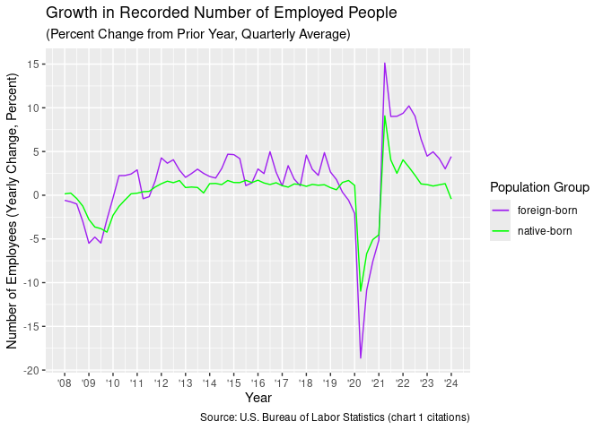
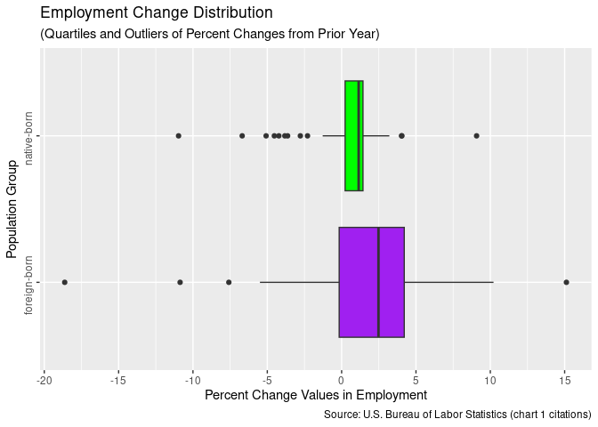
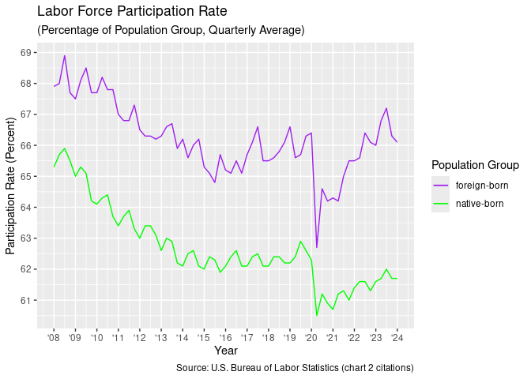
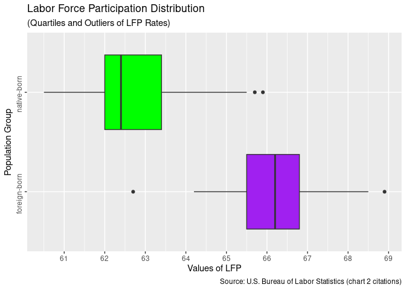
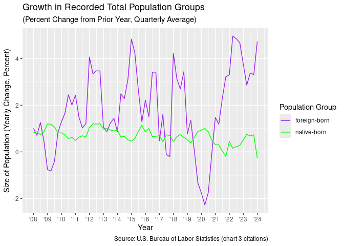
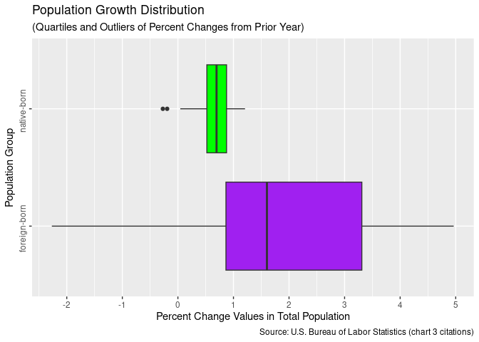
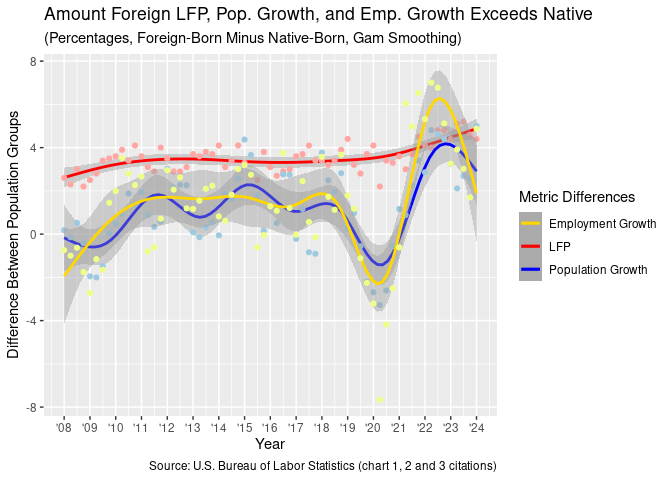
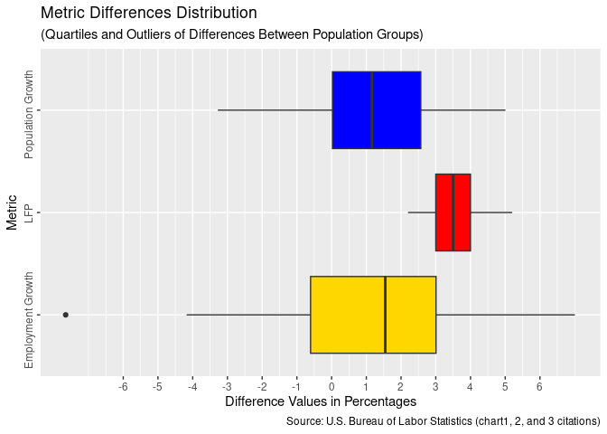
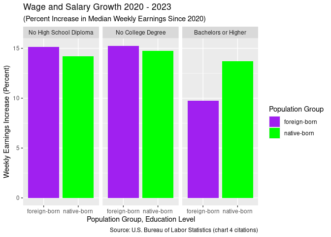

Macro Analysis of Immigration and the Labor Force
================

Jared White
2024-04-10

##### License: [CC-BY-4.0](https://creativecommons.org/licenses/by/4.0/deed.en)

    ## [1] "FRED API key is available."

### Bottom Line Upfront

- **Growth in Employment** is more volatile and strongly correlated with
  overall U.S. economic health in the foreign-born population category
  than native-born.

- **Labor Force Participation Rates** are consistently higher in the
  foreign-born population category and recover faster from disincentive
  to employment.

- **Growth in Total Population** in the foreign-born category outpaces
  that of the native-born. Population Growth shows correlation with
  employment growth in the foreign-born category, but not the
  native-born. Labor Force Participation shows no correlation to
  employment in either category.

- **Wages and Salaries** are converging between the two population
  categories across all education levels, with the disparity in wages
  smallest among college-educated individuals, indicating faster wage
  equalization for native-born workers.

### Employment Levels

##### Foreign Born is defined as:

*“The foreign born are persons who reside in the United States but who
were not U.S. citizens at birth. Specifically, they were born outside
the United States (or one of its outlying areas such as Puerto Rico or
Guam), and neither parent was a U.S. citizen. The foreign born include
legally-admitted immigrants, refugees, temporary residents such as
students and temporary workers, and undocumented immigrants. However,
the survey does not separately identify persons in these categories. For
further information about the survey, see the Technical Note in this
news release.”* [(Bureau of Labor
Statistics)](https://www.bls.gov/news.release/forbrn.htm)

<!-- -->

<!-- -->

##### Foreign-Born Employment Change Numeric Summary:

<table>
<thead>
<tr>
<th style="text-align:center;">
Minimum -
</th>
<th style="text-align:center;">
1st Quartile -
</th>
<th style="text-align:center;">
Median -
</th>
<th style="text-align:center;">
3rd Quartile -
</th>
<th style="text-align:center;">
Maximum -
</th>
<th style="text-align:center;">
Standard Deviation
</th>
</tr>
</thead>
<tbody>
<tr>
<td style="text-align:center;">
-18.63
</td>
<td style="text-align:center;">
-0.16
</td>
<td style="text-align:center;">
2.48
</td>
<td style="text-align:center;">
4.21
</td>
<td style="text-align:center;">
15.12
</td>
<td style="text-align:center;">
4.94
</td>
</tr>
</tbody>
</table>

##### Native-Born Employment Change Numeric Summary:

<table>
<thead>
<tr>
<th style="text-align:center;">
Minimum -
</th>
<th style="text-align:center;">
1st Quartile -
</th>
<th style="text-align:center;">
Median -
</th>
<th style="text-align:center;">
3rd Quartile -
</th>
<th style="text-align:center;">
Maximum -
</th>
<th style="text-align:center;">
Standard Deviation
</th>
</tr>
</thead>
<tbody>
<tr>
<td style="text-align:center;">
-10.97
</td>
<td style="text-align:center;">
0.23
</td>
<td style="text-align:center;">
1.14
</td>
<td style="text-align:center;">
1.44
</td>
<td style="text-align:center;">
9.08
</td>
<td style="text-align:center;">
2.69
</td>
</tr>
</tbody>
</table>

##### Analyst Comment:

It’s important to note that these statistics do not differentiate
between subgroups of foreign-born individuals in the U.S. The
percentages indicate the degree of growth or decline in the total number
of recorded employed individuals from the same quarter of the previous
year.

This chart illustrates that while the growth in the number of employed
foreign-born individuals typically outpaces that of native-born
individuals during periods of economic stability, foreign-born
employment declines more rapidly and profoundly during recessions (e.g.,
in 2008 and 2020). Conversely, foreign-born employment also increases
more quickly during economic recovery from recession. In other words,
foreign-born employment exhibits greater volatility and a stronger
correlation with economic health compared to native-born employment.

It’s essential to recognize that correlation does not imply causation.
Based on the available data, there are several equally plausible
insights that are **not mutually exclusive**:

1. The overall health and outlook of the broader U.S. economy have a
   more significant impact on the employment of foreign-born
   individuals than on native-born individuals.

2. Employment of foreign-born individuals serves simultaneously as both
   a pillar and an indicator of overall U.S. economic health.

3. Since the category of foreign-born workers encompasses immigrants of
   all legal and employable statuses (work visa, sponsorship,
   naturalized, documented/undocumented, etc.), the data also suggests
   that this population group may be perceived by many employers as
   simultaneously more expendable and more readily attainable than
   native-born employees.

4. Foreign-born employees may also be disproportionately predisposed to
   work in sectors that are more profoundly affected by the overall
   health of the economy.

### Labor Force Participation Rate

##### Labor Force Participation is:

*“The Bureau of Labor Statistics (BLS), a federal agency that measures
labor market activity, working conditions, price changes and
productivity, defines the labor force participation (LFP) rate as the
number of people who are either working or actively seeking work as a
share of the working age population. The working age population consists
of people 16 years and over.”* [(Federal Reserve Bank of
St. Louis)](https://www.stlouisfed.org/open-vault/2020/august/labor-force-participation-rate-explained)

<!-- -->

<!-- -->

##### Foreign-Born LFP Rate Numeric Summary:

<table>
<thead>
<tr>
<th style="text-align:center;">
Minimum -
</th>
<th style="text-align:center;">
1st Quartile -
</th>
<th style="text-align:center;">
Median -
</th>
<th style="text-align:center;">
3rd Quartile -
</th>
<th style="text-align:center;">
Maximum -
</th>
<th style="text-align:center;">
Standard Deviation
</th>
</tr>
</thead>
<tbody>
<tr>
<td style="text-align:center;">
62.7
</td>
<td style="text-align:center;">
65.5
</td>
<td style="text-align:center;">
66.2
</td>
<td style="text-align:center;">
66.8
</td>
<td style="text-align:center;">
68.9
</td>
<td style="text-align:center;">
1.15
</td>
</tr>
</tbody>
</table>

##### Native-Born LFP Rate Numeric Summary:

<table>
<thead>
<tr>
<th style="text-align:center;">
Minimum -
</th>
<th style="text-align:center;">
1st Quartile -
</th>
<th style="text-align:center;">
Median -
</th>
<th style="text-align:center;">
3rd Quartile -
</th>
<th style="text-align:center;">
Maximum -
</th>
<th style="text-align:center;">
Standard Deviation
</th>
</tr>
</thead>
<tbody>
<tr>
<td style="text-align:center;">
60.5
</td>
<td style="text-align:center;">
62
</td>
<td style="text-align:center;">
62.4
</td>
<td style="text-align:center;">
63.4
</td>
<td style="text-align:center;">
65.9
</td>
<td style="text-align:center;">
1.28
</td>
</tr>
</tbody>
</table>

##### Analyst Comment:

While both population groups exhibit similar deviations and ranges in
their Labor Force Participation Rates(LFP), the foreign-born category
displays a consistently higher LFP compared to the native-born
population. Notably, the outlying minimum of foreign-born LFP is 0.3%
higher than the median of the native-born group. In striking inverse
similarity, the maximum LFP for the native-born group is 0.3% lower than
the foreign-born median.

The data from 2020 onward suggests that foreign-born workers are much
quicker to either return to work or seek reemployment following a mass
disincentive to employment. By the second quarter of 2022, the LFP of
the foreign-born population had recovered to pre-pandemic levels,
whereas native-born LFP has only partially reversed its total
pandemic-induced decrease to date.

### Total Population Growth

##### Measurement of Population:

*“Civilian noninstitutional population is defined as persons 16 years of
age and older residing in the 50 states and the District of Columbia,
who are not inmates of institutions (e.g., penal and mental facilities,
homes for the aged), and who are not on active duty in the Armed
Forces.”* [(Federal Reserve Bank of
St. Louis)](https://fred.stlouisfed.org/series/LNU00073413#0)

<!-- -->

<!-- -->

##### Foreign-Born Population Growth Numeric Summary:

<table>
<thead>
<tr>
<th style="text-align:center;">
Minimum -
</th>
<th style="text-align:center;">
1st Quartile -
</th>
<th style="text-align:center;">
Median -
</th>
<th style="text-align:center;">
3rd Quartile -
</th>
<th style="text-align:center;">
Maximum -
</th>
<th style="text-align:center;">
Standard Deviation
</th>
</tr>
</thead>
<tbody>
<tr>
<td style="text-align:center;">
-2.27
</td>
<td style="text-align:center;">
0.86
</td>
<td style="text-align:center;">
1.6
</td>
<td style="text-align:center;">
3.31
</td>
<td style="text-align:center;">
4.96
</td>
<td style="text-align:center;">
1.75
</td>
</tr>
</tbody>
</table>

##### Native-Born Population Growth Numeric Summary:

<table>
<thead>
<tr>
<th style="text-align:center;">
Minimum -
</th>
<th style="text-align:center;">
1st Quartile -
</th>
<th style="text-align:center;">
Median -
</th>
<th style="text-align:center;">
3rd Quartile -
</th>
<th style="text-align:center;">
Maximum -
</th>
<th style="text-align:center;">
Standard Deviation
</th>
</tr>
</thead>
<tbody>
<tr>
<td style="text-align:center;">
-0.27
</td>
<td style="text-align:center;">
0.52
</td>
<td style="text-align:center;">
0.7
</td>
<td style="text-align:center;">
0.88
</td>
<td style="text-align:center;">
1.21
</td>
<td style="text-align:center;">
0.31
</td>
</tr>
</tbody>
</table>

##### Analyst Comment:

Given the intrinsic link between immigration and public policy, it’s not
surprising that total population growth is much more volatile in the
foreign-born population category. However, what is notable is that total
population growth in the foreign-born category is the only metric
correlated with employment growth in the same category.

Comparing chart 3 with chart 1 reveals that both employment and total
population decrease in the foreign-born category during economic
recession. In contrast, the growth of the total native-born population
shows a slight increase during periods of decreased employment.

From the available data, it’s equally plausible that:

1. Individuals in the foreign-born population group are, on average,
   more likely to leave the measured population when economic
   opportunities decrease compared to their native-born counterparts.

2. A decrease in the availability of foreign-born employees and workers
   exacerbates or causes underlying issues of economic instability.

##### Correlations of Population Growth and LFP with Employment Growth:

<table>
<thead>
<tr>
<th style="text-align:center;">
group
</th>
<th style="text-align:center;">
population_growth
</th>
<th style="text-align:center;">
lfp
</th>
</tr>
</thead>
<tbody>
<tr>
<td style="text-align:center;">
foreign-born
</td>
<td style="text-align:center;">
0.72
</td>
<td style="text-align:center;">
-0.01
</td>
</tr>
<tr>
<td style="text-align:center;">
native-born
</td>
<td style="text-align:center;">
-0.29
</td>
<td style="text-align:center;">
-0.17
</td>
</tr>
</tbody>
</table>

Foreign-born total population growth is the only metric that exhibits a
significant correlation score with employment growth (correlation of
0.72). Native-born population growth shows a very slight negative
correlation with employment growth. Labor Force Participation Rates show
no correlation with employment growth in either population group.

### Differences in Metrics between Population Groups Over Time

$$
\large Plot=\frac{Foreign-Native}{Time}
$$

<!-- -->

<!-- -->

##### Metric Differences Numeric Summary:

<table>
<thead>
<tr>
<th style="text-align:center;">
Metric
</th>
<th style="text-align:center;">
Minimum -
</th>
<th style="text-align:center;">
1st Quartile -
</th>
<th style="text-align:center;">
Median -
</th>
<th style="text-align:center;">
3rd Quartile -
</th>
<th style="text-align:center;">
Maximum -
</th>
<th style="text-align:center;">
Corr with Diff in Empl Growth
</th>
</tr>
</thead>
<tbody>
<tr>
<td style="text-align:center;">
LFP
</td>
<td style="text-align:center;">
2.20
</td>
<td style="text-align:center;">
3.00
</td>
<td style="text-align:center;">
3.50
</td>
<td style="text-align:center;">
4.00
</td>
<td style="text-align:center;">
5.20
</td>
<td style="text-align:center;">
0.53
</td>
</tr>
<tr>
<td style="text-align:center;">
Pop. Growth
</td>
<td style="text-align:center;">
-3.28
</td>
<td style="text-align:center;">
0.03
</td>
<td style="text-align:center;">
1.16
</td>
<td style="text-align:center;">
2.57
</td>
<td style="text-align:center;">
5.01
</td>
<td style="text-align:center;">
0.84
</td>
</tr>
</tbody>
</table>

##### Analyst Comment:

This plot displays the differences in Employment Growth, Total
Population Growth, and LFP between the two population categories. It
demonstrates the amount by which the foreign-born category exceeded the
native-born category in each metric. Positive points indicate that the
foreign-born category experienced either a higher growth rate or a
slower decline rate for that metric and time period. Conversely, values
below zero indicate that either the growth of the native-born category
exceeded that of the foreign-born, or that a decrease occurred at a
lesser rate for the native-born.

The difference between the two population categories shows a stronger
correlation of both Total Population Growth and LFP with Growth in
Employment. However, it is evident that the change in total population
is more strongly correlated with change in employment than the Labor
Force Participation Rate.

### Wage Growth

##### Measurement of Weekly Earnings:

*“Data measure usual weekly earnings of wage and salary workers. Wage
and salary workers are workers who receive wages, salaries, commissions,
tips, payment in kind, or piece rates. The group includes employees in
both the private and public sectors but, for the purposes of the
earnings series, it excludes all self-employed persons, both those with
incorporated businesses and those with unincorporated businesses.”*
[(Federal Reserve Bank of
St. Louis)](https://fred.stlouisfed.org/series/LEU0257370400A)

<!-- -->

##### 2023 Median Weekly Earnings (Dollar Amounts):

<table>
<thead>
<tr>
<th style="text-align:center;">
Population Group -
</th>
<th style="text-align:center;">
No High School Diploma -
</th>
<th style="text-align:center;">
No College Degree -
</th>
<th style="text-align:center;">
Bachelors or Higher -
</th>
</tr>
</thead>
<tbody>
<tr>
<td style="text-align:center;">
foreign-born
</td>
<td style="text-align:center;">
692
</td>
<td style="text-align:center;">
809
</td>
<td style="text-align:center;">
1637
</td>
</tr>
<tr>
<td style="text-align:center;">
native-born
</td>
<td style="text-align:center;">
748
</td>
<td style="text-align:center;">
919
</td>
<td style="text-align:center;">
1602
</td>
</tr>
<tr>
<td style="text-align:center;">
difference
</td>
<td style="text-align:center;">
-56
</td>
<td style="text-align:center;">
-110
</td>
<td style="text-align:center;">
35
</td>
</tr>
</tbody>
</table>

##### Analyst Comments:

In education categories where the median wage is higher for native-born
workers, foreign-born wages have shown a slightly higher percentage
increase since 2020 compared to native-born workers. College-educated
native-born workers’ weekly earnings demonstrate a significantly higher
percentage increase than their foreign-born educated counterparts.
Interestingly, this is the only education category in which foreign-born
workers’ median earnings surpass those of native-born workers in dollar
amount.

Additionally, the disparity in wages among college-educated individuals
is the smallest among all education levels. This means that, while wages
are converging between the two population categories across all levels
of education, they are doing so at a much faster rate for native-born
workers.

### Conclusion

Economics is one aspect of the broader national discourse on
immigration. Further complicating this issue is the lack of transparency
and granularity of the statistics provided by the Bureau of Labor
Statistics. It is impossible to discern what proportion of the recorded
foreign-born workers are legally working or residing in the U.S. Since
this category also encompasses undocumented residents, the extent to
which the BLS sample represents the entire population group remains
uncertain.

What can be concluded, however, is that with a consistently higher Labor
Force Participation Rate and population growth that correlates more
strongly with employment levels, the foreign-born population category
serves as an essential factor in the labor market and broader economy.
While, under the right circumstances, any population group can
theoretically exert downward pressure on wages, the available data does
not support the theory that this applies universally to foreign-born
workers.

If the current trends continue, the U.S. economy will likely experience:

- A continued decline in native-born Labor Force Participation relative
  to that of the foreign-born category.

- A greater proportion of foreign-born individuals within the total
  population.

- An Increasing disparity in employment growth between the two
  population categories.

- Rising wages and salaries that also become more equitable across all
  population segments.

### Citations

#### Citations for Employment Level (chart 1):

U.S. Bureau of Labor Statistics, Employment Level - Foreign Born
\[LNU02073395\], retrieved from FRED, Federal Reserve Bank of St. Louis;
<https://fred.stlouisfed.org/series/LNU02073395>, April 5, 2024.

U.S. Bureau of Labor Statistics, Employment Level - Native Born
\[LNU02073413\], retrieved from FRED, Federal Reserve Bank of St. Louis;
<https://fred.stlouisfed.org/series/LNU02073413>, April 5, 2024.

#### Citations for Labor Force Participation Rates (chart 2):

U.S. Bureau of Labor Statistics, Labor Force Participation Rate -
Foreign Born \[LNU01373395\], retrieved from FRED, Federal Reserve Bank
of St. Louis; <https://fred.stlouisfed.org/series/LNU01373395>, April 6,
2024.

U.S. Bureau of Labor Statistics, Labor Force Participation Rate - Native
Born \[LNU01373413\], retrieved from FRED, Federal Reserve Bank of
St. Louis; <https://fred.stlouisfed.org/series/LNU01373413>, April 6,
2024.

#### Citations for Total Population (chart 3):

U.S. Bureau of Labor Statistics, Population Level - Foreign Born
\[LNU00073395\], retrieved from FRED, Federal Reserve Bank of St. Louis;
<https://fred.stlouisfed.org/series/LNU00073395>, April 7, 2024.

U.S. Bureau of Labor Statistics, Population Level - Native Born
\[LNU00073413\], retrieved from FRED, Federal Reserve Bank of St. Louis;
<https://fred.stlouisfed.org/series/LNU00073413>, April 7, 2024.

#### Citations for Wage Growth (chart 4):

U.S. Bureau of Labor Statistics, Employed full time: Median usual weekly
nominal earnings (second quartile): Wage and salary workers: Less than a
High School diploma: 25 years and over: Foreign born \[LEU0257370100A\],
retrieved from FRED, Federal Reserve Bank of St. Louis;
<https://fred.stlouisfed.org/series/LEU0257370100A>, April 7, 2024.

U.S. Bureau of Labor Statistics, Employed full time: Median usual weekly
nominal earnings (second quartile): Wage and salary workers: Less than a
High School diploma: 25 years and over: Native born \[LEU0257375500A\],
retrieved from FRED, Federal Reserve Bank of St. Louis;
<https://fred.stlouisfed.org/series/LEU0257375500A>, April 7, 2024.

U.S. Bureau of Labor Statistics, Employed full time: Median usual weekly
nominal earnings (second quartile): Wage and salary workers: High School
graduates, No Degree: 25 years and over: Foreign born
\[LEU0257370200A\], retrieved from FRED, Federal Reserve Bank of
St. Louis; <https://fred.stlouisfed.org/series/LEU0257370200A>, April 7,
2024.

U.S. Bureau of Labor Statistics, Employed full time: Median usual weekly
nominal earnings (second quartile): Wage and salary workers: High School
graduates, No Degree: 25 years and over: Native born \[LEU0257375600A\],
retrieved from FRED, Federal Reserve Bank of St. Louis;
<https://fred.stlouisfed.org/series/LEU0257375600A>, April 7, 2024.

U.S. Bureau of Labor Statistics, Employed full time: Median usual weekly
nominal earnings (second quartile): Wage and salary workers: Bachelor’s
degree and higher: 25 years and over: Foreign born \[LEU0257370400A\],
retrieved from FRED, Federal Reserve Bank of St. Louis;
<https://fred.stlouisfed.org/series/LEU0257370400A>, April 7, 2024.

U.S. Bureau of Labor Statistics, Employed full time: Median usual weekly
nominal earnings (second quartile): Wage and salary workers: Bachelor’s
degree and higher: 25 years and over: Native born \[LEU0257375800A\],
retrieved from FRED, Federal Reserve Bank of St. Louis;
<https://fred.stlouisfed.org/series/LEU0257375800A>, April 7, 2024.

#### Citations for R and Libraries

R Core Team (2021). R: A language and environment for statistical
computing. R Foundation for Statistical Computing, Vienna, Austria. URL
<https://www.R-project.org/>.

Wickham H, Averick M, Bryan J, Chang W, McGowan LD, François R,
Grolemund G, Hayes A, Henry L, Hester J, Kuhn M, Pedersen TL, Miller E,
Bache SM, Müller K, Ooms J, Robinson D, Seidel DP, Spinu V, Takahashi K,
Vaughan D, Wilke C, Woo K, Yutani H (2019). “Welcome to the tidyverse.”
*Journal of Open Source Software*, *4*(43), 1686. doi:
10.21105/joss.01686 (URL: <https://doi.org/10.21105/joss.01686>).

Sam Boysel and Davis Vaughan (2021). fredr: An R Client for the ‘FRED’
API. R package version 2.1.0. <https://CRAN.R-project.org/package=fredr>

Garrett Grolemund, Hadley Wickham (2011). Dates and Times Made Easy with
lubridate. Journal of Statistical Software, 40(3), 1-25. URL
<https://www.jstatsoft.org/v40/i03/>.

Hadley Wickham, Thomas Lin Pedersen and Dana Seidel (2023). scales:
Scale Functions for Visualization. R package version 1.3.0.
<https://CRAN.R-project.org/package=scales>
